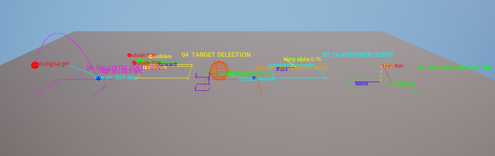
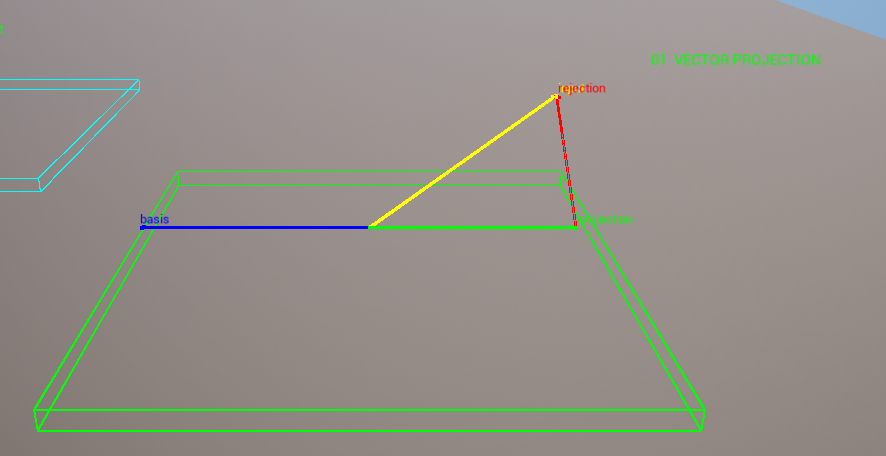
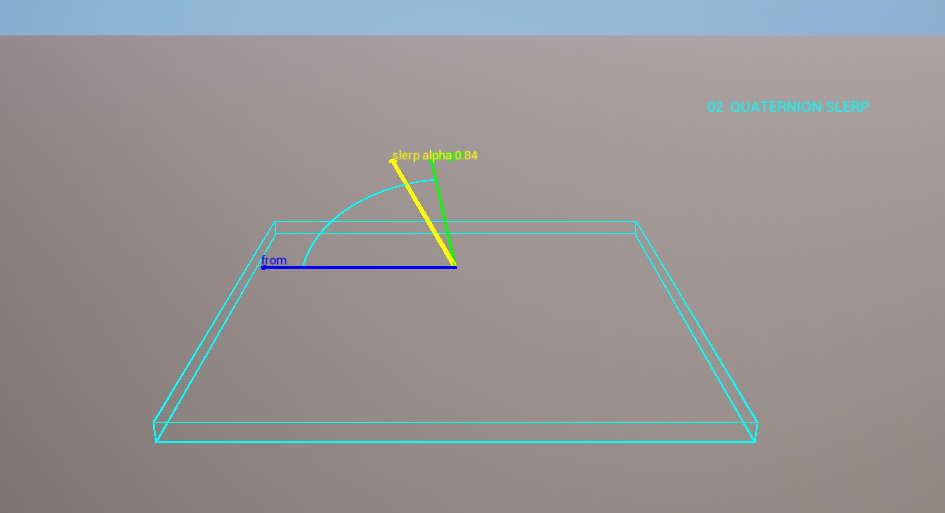
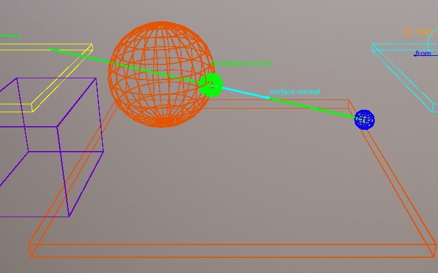
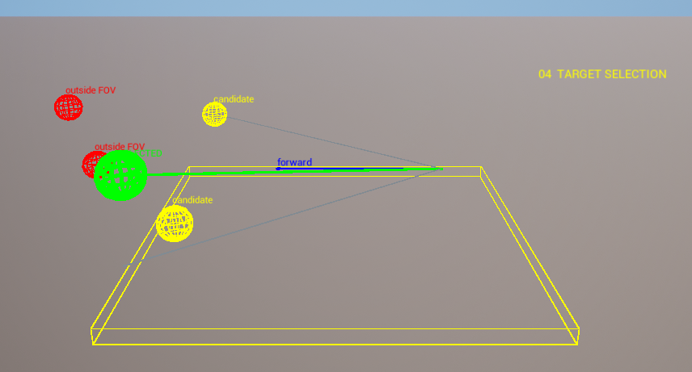
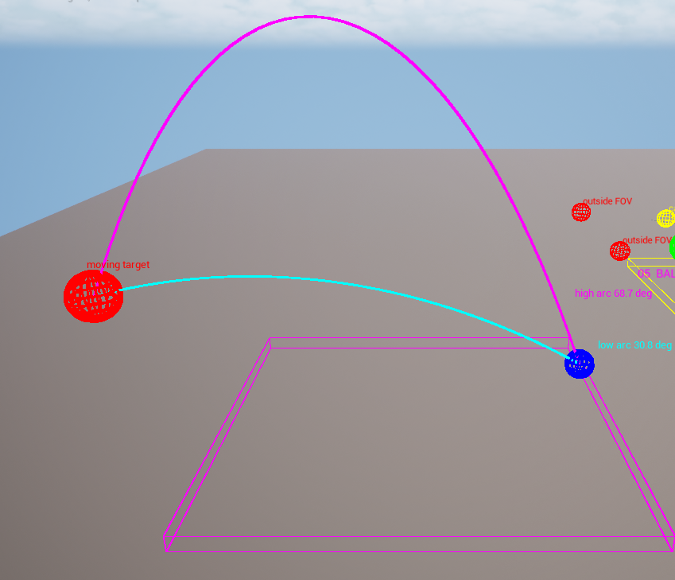
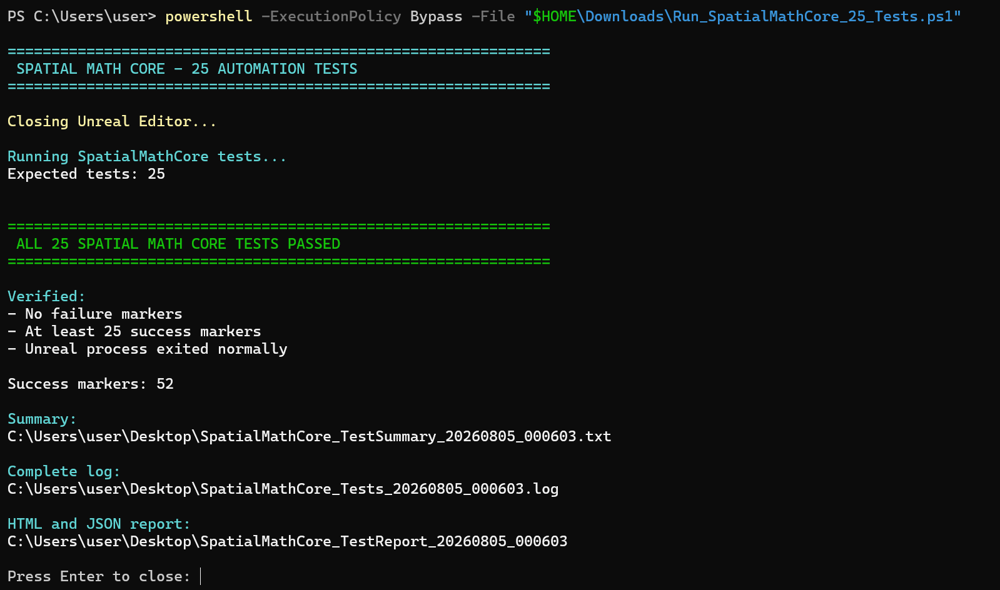

# SpatialMathLab

**Unreal Engine 5.8 C++ spatial mathematics toolkit and interactive laboratory.**

SpatialMathLab demonstrates applied linear algebra, computational geometry, transforms, quaternions, targeting math and analytical ballistics through a reusable Runtime plugin, an interactive five-station laboratory and verified Unreal Automation Framework tests.



## Engineering Highlights

- reusable `SpatialMathCore` Runtime plugin;
- Blueprint-callable C++ API;
- vector projection, rejection and reflection;
- signed angles and field-of-view cone classification;
- closest-point and point-to-segment distance calculations;
- ray-plane, ray-sphere and ray-AABB intersections;
- barycentric coordinates and point-in-triangle classification;
- local/world transform conversion and transform round trips;
- shortest-arc quaternion rotation and normalized SLERP;
- analytical low/high ballistic trajectory solutions;
- free-fly C++ camera with station presets;
- 25 C++ automation tests covering normal and degenerate cases.

## Interactive Stations

### 1. Vector Projection

Decomposes an animated input vector into projection and rejection components relative to a basis vector.



### 2. Quaternion SLERP

Visualizes shortest-arc rotation and normalized spherical interpolation between two directions.



### 3. Ray Intersections

Visualizes a ray-sphere hit, hit distance, contact point, surface normal and a ray-AABB demonstration.



### 4. Target Selection

Classifies moving targets using range, field-of-view cone checks, dot-product alignment and distance weighting.



### 5. Ballistic Solutions

Solves and visualizes analytical low-arc and high-arc projectile trajectories under gravity.



## Camera Controls

| Key | Action |
|---|---|
| `0` | Overview |
| `1` | Vector Projection |
| `2` | Quaternion SLERP |
| `3` | Ray Intersections |
| `4` | Target Selection |
| `5` | Ballistic Solutions |
| `WASD` | Free movement |
| `Q / E` | Move down / up |
| `Shift` | Faster movement |
| Hold `RMB` | Free look |

## Automated Verification

All 25 `SpatialMathCore` tests passed after the final visual and camera changes.



Test areas include:

- numerical vector operations;
- zero-length and degenerate inputs;
- signed-angle orientation;
- clamped closest points;
- cone inclusion and exclusion;
- ray hits, misses, parallel cases and tangency;
- barycentric inside/outside classification;
- transform round-trip accuracy;
- quaternion endpoint behavior;
- reachable and unreachable ballistic solutions.

See [docs/TESTING.md](docs/TESTING.md) for reproduction instructions and verified results.

## Architecture

```text
SpatialMathLab/
├── Plugins/
│   └── SpatialMathCore/
│       └── Source/
│           └── SpatialMathCore/
│               ├── Public/
│               └── Private/
│                   └── Tests/
├── Source/
│   └── SpatialMathLab/
├── Content/
├── Config/
├── Tools/
├── docs/
└── media/
```

The mathematical systems live in the reusable plugin. The host project is responsible for the demonstration laboratory, camera controls and presentation.

See [docs/ARCHITECTURE.md](docs/ARCHITECTURE.md) and [docs/MATHEMATICS.md](docs/MATHEMATICS.md).

## Build

Requirements:

- Unreal Engine 5.8;
- Visual Studio with the Game development with C++ workload;
- Windows 64-bit.

Open `SpatialMathLab.uproject`. Unreal may rebuild the C++ modules automatically. The project uses `BuildSettingsVersion.V7`.

## Portfolio Evidence

This project was built to provide direct, reviewable evidence of applied 3D mathematics rather than relying on a generic `Linear Algebra` entry in a skills list.

**CV summary:**

> Developed a reusable Unreal Engine 5.8 C++ plugin for vector decomposition, signed angles, transform-space conversion, quaternion interpolation, ray intersections, target selection and analytical ballistic trajectories. Added an interactive five-station laboratory, Blueprint APIs and 25 automation tests covering numerical and degenerate edge cases.

## Author

**Milena Strahova**

- GitHub: [github.com/milenastrahova](https://github.com/milenastrahova)
- ArtStation: [artstation.com/milenastrahova](https://www.artstation.com/milenastrahova)